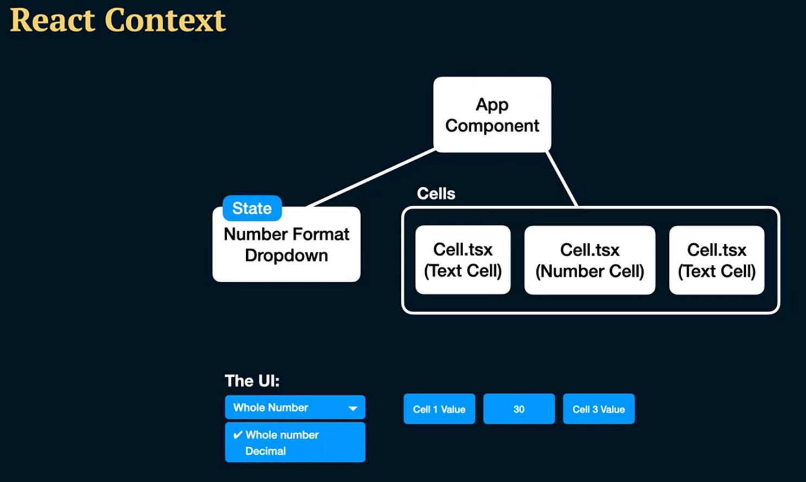
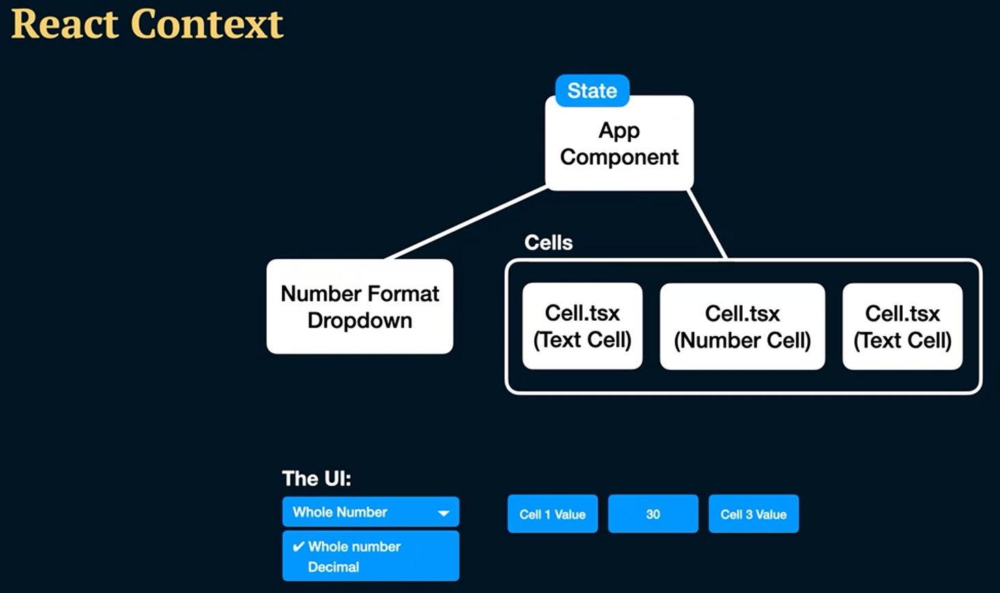
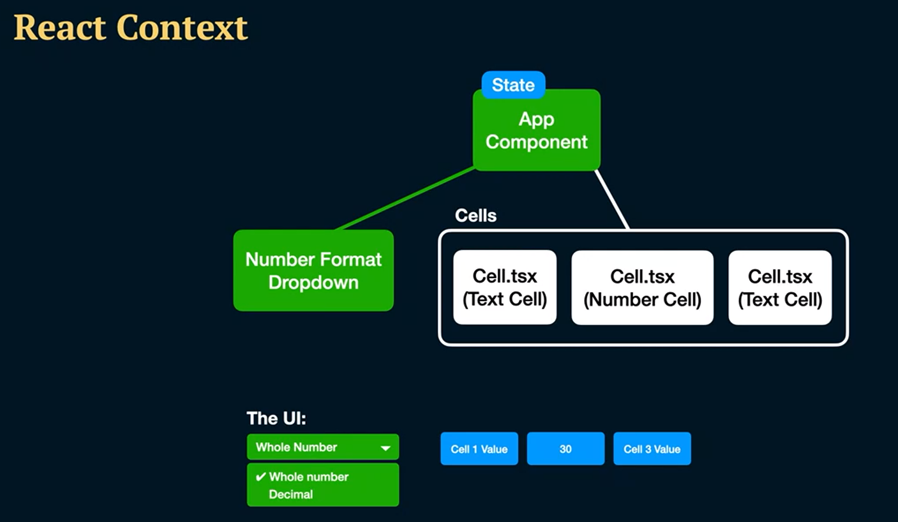
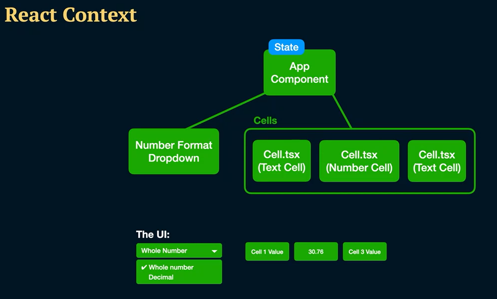
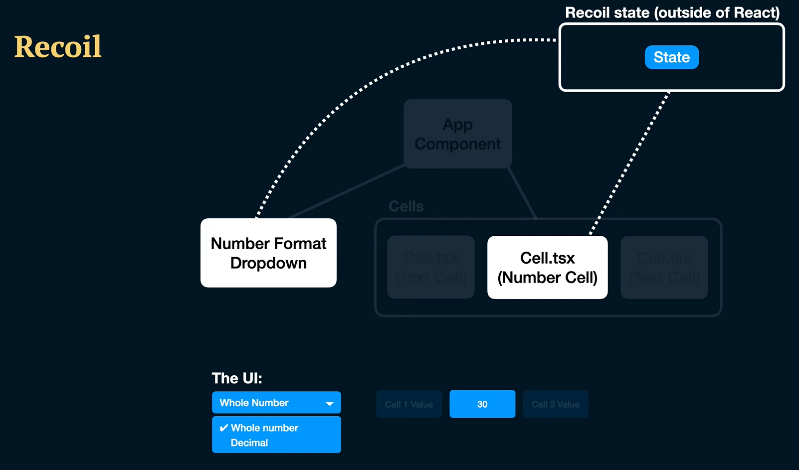
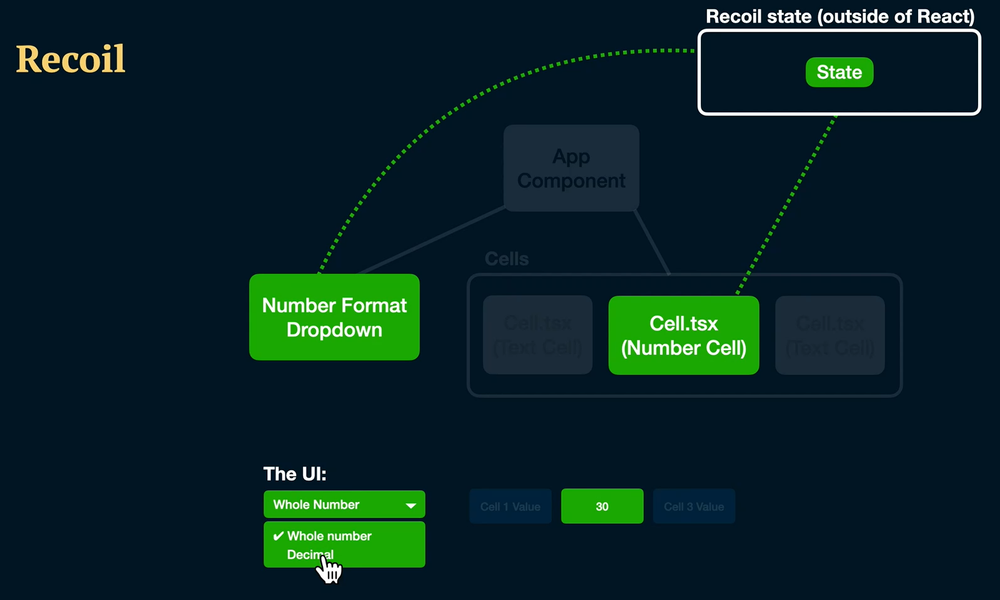

# L'histoire de Recoil

[Recoil](https://recoiljs.org/fr/) a débuté en tant librairie de gestion des states dans un projet interne 
chez Facebook.  
Puis, en mai 2020 un des créateurs de Recoil, Dave McCabe, a annoncé le projet Recoil lors de la conférence 
[Reacteurope](https://www.youtube.com/watch?v=_ISAA_Jt9kI), rendant le projet disponible auprès du public en tant que 
librairie expérimentale.

## Pourquoi avoir créé Recoil ?

Les solutions de gestion de state existentes à l'époque n'offraient tout simplement pas les 
performances ni les features nécessaires.  
Le projet initial pour lequel Recoil a été développé contenait un très grand nombre de rendered components qui 
se devaient de *pouvoir être mis à jour fréquemment, et de manière isolée*.

Recoil a été créé sur la base des idées suivantes :

- «**Flexible shared state**» : 
  - pas besoin de reducers. 
  - on se contente de **set**/**get** les valeurs. 
  - Le tout en permettant une fragmentation du code.

- «**Derived data**» : 
  - la data peut être déviée de manière simple et sans risque, que ce soit depuis un state ou depuis 
  une autre data qui aurait elle-même été dérivée. 
  - le but était également de permettre l'accès à une data déviée de la même 
  manière qu'on accède à un state.
  - la data dérivée peut être **synchrone** *ou* **asynchrone**.

- «**App-wide state observation**» :
  - on peut lire n'importe quelle partie du Recoil state.
  - on observe tous les changements du state, et donc on peut hook sur n'importe quel changement du state.
  - on peut faire persister le state de l'application (dans une API ou un fichier par exemple).
  - on peut réhydrater le state de l'application, depuis n'importe quelle source où celui-ci aurait été stocké. 
  Cette dernière partie se veut «*backward compatible*», donc si le state persistant, se trouve au sein d'une structure
  plus ancienne que celle du nouveau state (du code), le tout se doit d'être fonctionnel.

## Pourquoi utiliser Recoil ?

Recoil est une solution à envisager lorsque l'arbre de components de votre application et la structure de votre state ne 
correspondent pas l'un à l'autre.  

Prenons un cas concret d'application qui serait un outil de spreadsheet, composé de cellules ainsi que de formats pour le
display des valeurs. Les extensions **.tsx** correspondent à des fichiers en TypeScript :

Admettons que nous souhaitions faire en sorte que toutes les cellules n'affichent que du texte.  
Avec React State, on transmettrait l'état au parent commun à tous les composants, ici le *App Component* : 

Le problème ici est que, le parent va devoir rerender : 

Ce qui entrainera également le rerendering de tous les enfants : 

En soi, pour de petites applications, cela pose peu de problèmes.  
Cependant, sitôt qu'on rentre dans le cadre d'applications plus complexes, alors cette problématique va être un des 
enjeux majeurs en ce qui concerne les performances de votre application. Imaginez que vous ayez 150 components dans 
votre application ... il est impensable de vouloir les forcer à tous rerender en même temps.  
Le problème est encore plus visible si vos components se retrouvent éloignés les uns des autres au sein de votre 
structure. Dans ce cas, cela signifie que pour mettre à jour un component dépendant de la mise à jour d'un parent 
éloigné, vous devrez passer par plusieurs autres components. Tout cela ralentira violemment votre application.

C'est là qu'intervient Recoil !

Si votre state est stocké hors de React, alors vous pouvez faire naviguer votre state d'un component à un autre :

De cette manière, seuls les components qui ont besoin d'être mis à jour le seront, et donc le rerendering ne se fera que 
pour ceux-là :

## À quel moment vaut-il mieux privilégier une autre librairie à Recoil ?

Si les données de votre application sont directement liées à des entités ou encore à une base de données, alors d'autres
solutions peuvent être envisagées. Par exemple [React Query](https://react-query-v3.tanstack.com/) ou encore 
[Apollo](https://www.apollographql.com/docs/react/).  
Cela étant dit, rien ne vous empêche de combiner Recoil à ces librairies.  
N'oubliez pas qu'en tant que développeur, l'important est de savoir quand utiliser quelle solution. Dans le cas de ces 
librairies, il sera donc important de déterminer lesquelles seront les plus pertinentes concernant la gestion du state 
de votre application.