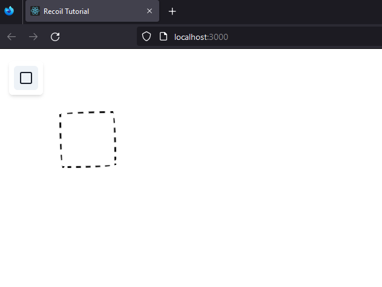
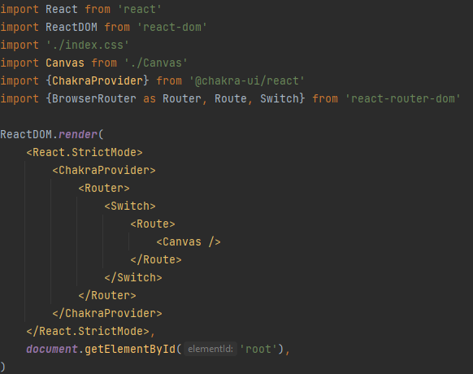
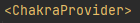
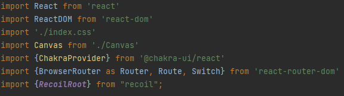
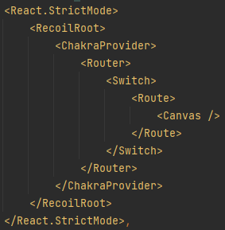

# Tutoriel 


## Installation 

Récupérez le projet sur lequel nous allons travailler dans le dossier recoil-tutorial.  
Vous obtiendrez ainsi un embryon d'application React standard qui nous servira de base.

Une fois ce dossier récupéré, afin d'installer toutes les dépendances, allez dans votre terminal pour run la commande 
suivante à la racine du dossier :

````bash
npm install
````

Si jamais vous rencontrez des erreurs, n'hésitez pas à faire les commandes suivantes (dans l'ordre) :

````bash
npm install --force
````

````bash
npm audit fix --force
````

Une fois l'application installée, lancer la commande suivante :

````bash
npm start
````

Vous pouvez désormais vous rendre sur votre [localhost](http://localhost:3000) et voir l'application qui devrait 
ressembler à ceci : 



Votre projet est prêt ! 👍


## Structure du projet

Votre application est une React App assez basique (utilisant du Typescript pour le typage).  
Vous trouverez le bootstrap de l'application dans le fichier src/index.tsx :



Le style nécessaire à l'application est géré via le ChakraProvider grâce à la librairie chakra-ui :



Enfin, nous avons un router ainsi qu'une route par défaut, le tout géré par react-router-dom :


Désormais, nous désirons installer Recoil. Pour cela, entrez la commande suivante dans votre terminal :

````bash
npm install recoil
````

Dans votre bootstrap, importez RecoilRoot :



Enfin, faites un wrapping de votre application dans le wrapper RecoilRoot :



Désormais, n'importe quelle partie de notre application peut faire appel à Recoil ! 🤘