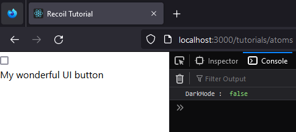

# Recoil : Atom


## Mise en place de components d'exemple

Dans le dossier /src de votre projet, créez un dossier que vous nommerez *tutorials*.  
Dans ce dernier, créez un fichier AtomsExample.tsx dans lequel vous copierez le code suivant :

````typescript jsx
import {useState} from "react";


function DarkModeSwitch() {
    const [darkMode, setDarkMode] = useState(false)

    console.log('DarkMode : ', darkMode)

    return (
        <input
            type="checkbox"
            checked={darkMode}
            onChange={event => {
                setDarkMode(event.currentTarget.checked)
            }}
        />
    )
}


function Button() {
    const [darkMode, setDarkMode] = useState(false)

    return (
        <button style={{backgroundColor: darkMode ? 'black' : 'white', color: darkMode ? 'white' : "black"}}>
            My wonderful UI button
        </button>
    )
}


export function AtomsExample() {
    return (
        <div>
            <div>
                <DarkModeSwitch />
            </div>
            <div>
                <Button />
            </div>
        </div>
    )
}
````

Comme vous pouvez le constater, ce fichier contient une function nommée AtomsExample, que sera exportée vers notre application.  
Celle-ci contient un bouton ainsi qu'une checkbox.

Désormais, nous voulons pouvoir accéder au visuel de nos components dans l'application.  
Pour ce faire, ajoutez une nouvelle route dans le bootstrap de votre application : 

````typescript jsx
    <React.StrictMode>
        <RecoilRoot>
            <ChakraProvider>
                <Router>
                    <Switch>
                        <Route path="/tutorials/atoms">
                            <AtomsExample />
                        </Route>
                        <Route>
                            <Canvas />
                        </Route>
                    </Switch>
                </Router>
            </ChakraProvider>
        </RecoilRoot>
    </React.StrictMode>,
````

Si vous vous rendez sur votre [http://localhost:3000/tutorials/atoms](http://localhost:3000/tutorials/atoms), 
vous devriez voir ceci :



Si vous vérifiez en console, le state *darkMode* de votre constante contenant la checkbox change en fonction de la 
valeur checked de votre checkbox :


Nous avons donc bien deux components mis en place et rendered.


Force est de constater que les deux components ne communiquent pas. Sinon le background du bouton deviendrait noir quand 
on coche la checkbox. Cela signifie donc que le state *darkMode* n'est pas partagé entre nos deux components.  
En théorie, on pourrait utiliser React Context pour palier à cela, mais ici, nous allons utiliser Recoil. 😋  

Pour rappel, Recoil sera plus pertinent dans le cas de la gestion du state d'applications où il y a une grosse quantité 
de components, surtout s'ils ne doivent pas tous communiquer les uns avec les autres, et donc n'ont pas vocation à être 
rerendered tous en même temps.


## Partage du state entre les components : Atom

Afin de partager le state entre nos deux components, nous allons créer un atom :

````typescript jsx
import {atom} from "recoil";


const darkModeAtom = atom({
    // Global State: {darkMode: true/false}
    key: 'darkMode',
    default: false,
})
````

Par convention, je vous encourage à ajouter le suffixe **Atom** à toutes vos constantes atom, afin de ne pas avoir de 
soucis de conflit quant aux nomenclatures (si on avait appelé notre atom *darkMode*, il y aurait probablement eu conflit 
avec le state homonyme).

Maintenant, analysons notre atom.
Celui-ci est composé :

- d'une **key**, qui est une valeur serializable qui servira de nom à notre atom :

````typescript jsx
// Global State: {darkMode: true/false}
// Ici on voit que le nom de notre atom est darkMode, et que sa valeur est un boolean.
    key: 'darkMode'
````

**NOTA BENE** :
 
Ne créez jamais un atom avec une clé identique à un autre atom. Vous créeriez des conflits et le 
gestionnaire de state ne saurait pas lequel des deux atoms doit être mis à jour. Et cela serait encore plus dramatique 
si vous initialisiez des valeurs par défaut différentes entre les deux atoms. Donc, ne faites **JAMAIS** cela.

- une valeur par défaut **default** :

````typescript jsx
// Cette valeur correspond à celle que nous avons initialisé dans notre useState.
// const [darkMode, setDarkMode] = useState(false)
default: false
````

Comme vous pouvez vous en rendre compte, l'API de Recoil fonctionne de manière assez similaire à useState.  
C'est pour cette raison que nous allons utiliser le gestionnaire de state de Recoil, **useRecoilState** :

````typescript jsx
import {atom, useRecoilState} from "recoil";
````

Après avoir importé useRecoilState, nous allons remplacer notre premier useState :

````typescript jsx
function DarkModeSwitch() {
    const [darkMode, setDarkMode] = useRecoilState(darkModeAtom)

    console.log('DarkMode : ', darkMode)

    return (
        <input
            type="checkbox"
            checked={darkMode}
            onChange={event => {
                setDarkMode(event.currentTarget.checked)
            }}
        />
    )
}
````

Contrairement au useState à qui l'on passe une default value, le useRecoilState recevra un atom. C'est ce dernier qui 
transmettra la default value.

Nous pouvons faire la même chose avec notre bouton :

````typescript jsx
function Button() {
    const [darkMode, setDarkMode] = useRecoilState(darkModeAtom)

    return (
        <button style={{backgroundColor: darkMode ? 'black' : 'white', color: darkMode ? 'white' : "black"}}>
            My wonderful UI button
        </button>
    )
}
````

Et maintenant, miracle : 


Désormais, nos deux components communiquent. On peut considérer dans le cas présent le state de Recoil comme deux 
useState liés l'un à l'autre.  
À chaque fois que l'on fait appel à *setDarkMode* en déclenchant l'événement de la checkbox, la value de l'atom est mise 
à jour dans le state, puis est transmise au bouton.  
À noter que, puisque Recoil est construit sur la base du buildIn state management de React, il est compatible avec 
d'autres features de React. D'autres librairies de gestion de state pourraient ne pas avoir cet avantage.


## Améliorations

Vous pouvez constater que nous n'utilisons pas le *setDarkMode* du bouton.  
Nous pouvons donc nous en débarrasser : 

````typescript jsx
function Button() {
    const [darkMode] = useRecoilState(darkModeAtom)

    return (
        <button style={{backgroundColor: darkMode ? 'black' : 'white', color: darkMode ? 'white' : "black"}}>
            My wonderful UI button
        </button>
    )
}
````

Néanmoins, plutôt que d'utiliser **useRecoilState**, puisque nous ne désirons plus que la valeur de l'atom, nous pouvons 
faire appel à un autre hook chargé de ne retourner que la valeur. J'ai nommé, **useRecoilValue** : 

````typescript jsx
import {atom, useRecoilState, useRecoilValue} from "recoil";
````

````typescript jsx
function Button() {
    const darkMode = useRecoilValue(darkModeAtom)

    return (
        <button style={{backgroundColor: darkMode ? 'black' : 'white', color: darkMode ? 'white' : "black"}}>
            My wonderful UI button
        </button>
    )
}
````

Désormais, nous n'aurons accès qu'au getter et non plus au setter via le bouton.  
Vous pouvez dès maintenant utiliser le *DarkModeSwitch* et le *Button* à n'importe quel endroit de votre application !

Vous savez à présent mettre en place un **atom**, utiliser **useRecoilState** ainsi que **useRecoilValue**.  
Vous êtes prêt à passer à la suite ! 💪