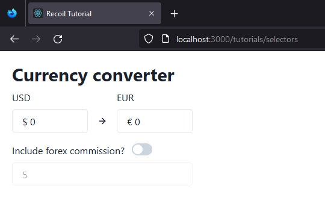
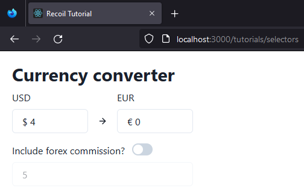
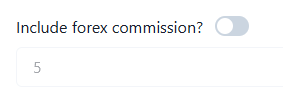

# Les SelectorsExample 

## Mise en place

Nous allons désormais voir une nouvelle façon de récupérer et transmettre de la donnée via un autre outil de Recoil : 
le **Selector**.  
Pour ce faire, nous allons créer un petit convertisseur de devises.  
Dans votre dossier src/tutorials, créez un nouveau fichier SelectorsExample.tsx dans lequel vous copierez le code 
suivant :

````typescript jsx
import {
    Box,
    FormControl,
    FormLabel,
    Heading,
    HStack,
    Icon,
    NumberInput,
    NumberInputField,
    Switch,
} from '@chakra-ui/react'
import {ArrowRight} from 'react-feather'
import {atom, useRecoilState} from 'recoil'

const exchangeRate = 0.95

export function SelectorsExample() {
    return (
        <div style={{padding: 20}}>
            <Heading size="lg" mb={2}>
                Currency converter
            </Heading>
            <InputStack>
                <CurrencyInput label="usd" amount={0}/>
                <CurrencyInput label="eur" amount={0}/>
            </InputStack>
            <Commission/>
        </div>
    )
}

// Vous pouvez ignorer tout ce qui se trouve en-dessous de ce commentaire pour le moment.
// Ce sont simplement des composants UI que nous utiliserons pour cet exemple.

const InputStack: React.FC = ({children}) => {
    return (
        <HStack
            width="300px"
            mb={4}
            spacing={4}
            divider={
                <Box border="0 !important" height="40px" alignItems="center" display="flex">
                    <Icon as={ArrowRight}/>
                </Box>
            }
            align="flex-end"
        >
            {children}
        </HStack>
    )
}

function CurrencyInput({
                           amount,
                           onChange,
                           label,
                       }: {
    label: string
    amount: number
    onChange?: (amount: number) => void
}) {
    let symbol = label === 'usd' ? '$' : '€'

    return (
        <FormControl id={label.toUpperCase()}>
            <FormLabel>{label.toUpperCase()}</FormLabel>
            <NumberInput
                value={`${symbol} ${amount}`}
                onChange={(value) => {
                    const withoutSymbol = value.split(' ')[0]
                    onChange?.(parseFloat(withoutSymbol || '0'))
                }}
            >
                <NumberInputField/>
            </NumberInput>
        </FormControl>
    )
}

const commissionEnabledAtom = atom({
    key: 'commissionEnabled',
    default: false,
})

const commissionAtom = atom({
    key: 'commission',
    default: 5,
})

function Commission() {
    const [enabled, setEnabled] = useRecoilState(commissionEnabledAtom)
    const [commission, setCommission] = useRecoilState(commissionAtom)

    return (
        <Box width="300px">
            <FormControl display="flex" alignItems="center" mb={2}>
                <FormLabel htmlFor="includeCommission" mb="0">
                    Include forex commission?
                </FormLabel>
                <Switch
                    id="includeCommission"
                    isChecked={enabled}
                    onChange={(event) => setEnabled(event.currentTarget.checked)}
                />
            </FormControl>
            <NumberInput
                isDisabled={!enabled}
                value={commission}
                onChange={(value) => setCommission(parseFloat(value || '0'))}
            >
                <NumberInputField/>
            </NumberInput>
        </Box>
    )
}

function addCommission(amount: number, commission: number) {
    return amount / (1 - commission / 100)
}

function removeCommission(amount: number, commission: number) {
    return amount * (1 - commission / 100)
}
````

**NOTA BENE** : *Notez que pour coller aux best practices, il faudrait que la fonction que l'on exporte soit déclarée 
                après les composants, ou que les composants soient déclarés dans d'autres fichiers et que l'on importe 
                ces derniers.*

Vous ajouterez également une route correspondant à ce fichier dans votre bootstrap : 

````typescript jsx
    <React.StrictMode>
        <RecoilRoot>
            <ChakraProvider>
                <Router>
                    <Switch>
                        <Route path="/tutorials/atoms">
                            <AtomsExample />
                        </Route>
                        <Route path="/tutorials/selectors">
                            <SelectorsExample />
                        </Route>
                        <Route>
                            <Canvas />
                        </Route>
                    </Switch>
                </Router>
            </ChakraProvider>
        </RecoilRoot>
    </React.StrictMode>
````

Vous devriez obtenir un display comme celui ci-dessous à l'adresse [http://localhost:3000/tutorials/selectors](http://localhost:3000/tutorials/selectors)



Parfait ! Nous avons notre base de travail.  
En l'état, vous pouvez constater que le convertisseur ne fonctionne pas. On ne peut même pas rentrer de nouvelles 
valeurs.  
Cela est tout simplement dû au fait que nos CurrencyInput n'ont pas encore d'événement onChange.  

````typescript jsx
<CurrencyInput label="usd" amount={0} />
<CurrencyInput label="eur" amount={0} />
````

## Mise en place de solutions via Recoil

Nous allons régler ce problème grâce à un atom : 

````typescript jsx
const usdAtom = atom({
    key: 'usd',
    default: 1
})
````

Puis, nous allons utiliser cet atom au sein de notre constante SelectorsExample : 

````typescript jsx
export function SelectorsExample() {
    // On crée un useRecoilState auquel on passe notre atom fraîchement créé.
    const [usd, setUSD] = useRecoilState(usdAtom)

    return (
        <div style={{padding: 20}}>
            <Heading size="lg" mb={2}>
                Currency converter
            </Heading>
            <InputStack>
                // On passe la valeur usd de notre setRecoilState à notre input, 
                // et on crée l'événement onChange qui fera appel au setter.
                <CurrencyInput label="usd" amount={usd} onChange={(usd) => setUSD(usd)} />
                <CurrencyInput label="eur" amount={0} />
            </InputStack>
            <Commission />
        </div>
    )
}
````

Désormais, vous pouvez initialiser une valeur en dollars :



Maintenant, ce que nous voulons, c'est que la valeur du dollar convertie en euro s'affiche.  
Vous l'avez sans doute remarqué, nous avons une variable qui fixe le taux de change : 

````typescript jsx
const exchangeRate = 0.95
````

Donc, nous pourrions simplement le faire en React en assignant au bon CurrencyInput la valeur suivante :

````typescript jsx
<CurrencyInput label="eur" amount={usd * exchangeRate} />
````

Et cela marcherait. Cependant, qu'en est-il si nous voulions réutiliser ce calcul ailleurs dans notre application ?  
Pour cette raison, nous allons utiliser un **Selector** de Recoil.

````typescript jsx
const eurSelector = selector({
    key: 'eur',
    // get est une fonction qui va retourner la valeur du selector
    // on déstructure le get en lui passant un get permettant de fetch la valeur de l'atom désiré
    // à chaque fois que l'atom va changer, le selector fera une nouvelle computation
    // afin d'afficher la bonne valeur
    get: ({get}) => {
        // fetching de la valeur de l'atom
        const usd = get(usdAtom)

        return usd * exchangeRate
    },
})
````

Il nous faut également mettre à jour la constante que nous exportons : 

````typescript jsx
export function SelectorsExample() {
    const [usd, setUSD] = useRecoilState(usdAtom)
    // récupération de la valeur du Selector
    const eur = useRecoilValue(eurSelector)

    return (
        <div style={{padding: 20}}>
            <Heading size="lg" mb={2}>
                Currency converter
            </Heading>
            <InputStack>
                <CurrencyInput label="usd" amount={usd} onChange={(usd) => setUSD(usd)} />
                <CurrencyInput label="eur" amount={eur} />
            </InputStack>
            <Commission />
        </div>
    )
}
````

Voilà ! Désormais, vous pouvez convertir vos dollars en euros. 💸

Toute l'idée du Selector est de pouvoir récupérer différentes parties du state afin de faire en sorte qu'elles compute 
pour retourner une nouvelle valeur.  
Dans notre cas, nous ne récupérons qu'un seul atom, mais nous pourrions parfaitement en récupérer plusieurs pour 
obtenir une nouvelle valeur.

Imaginons maintenant que nous voulions pouvoir faire l'inverse, c'est-à-dire convertir nos euros en dollars.  
Pour cela, nous allons passer une autre fonction à notre Selector, la fonction **set** :

````typescript jsx
const eurSelector = selector({
    key: 'eur',
    get: ({get}) => {
        const usd = get(usdAtom)

        return usd * exchangeRate
    },
    set: ({}, newEurValue) => {
        console.log('Set value', newEurValue)
    }
})
````

Puis, nous allons modifier la constante faisant appel à notre *eurSelector* dans la constante que l'on 
exporte, à savoir **SelectorsExample** :

````typescript jsx
export function SelectorsExample() {
    const [usd, setUSD] = useRecoilState(usdAtom)
    // const eur = useRecoilValue(eurSelector)
    const [eur, setEUR] = useRecoilState(eurSelector)

    return (
        <div style={{padding: 20}}>
            <Heading size="lg" mb={2}>
                Currency converter
            </Heading>
            <InputStack>
                <CurrencyInput label="usd" amount={usd} onChange={(usd) => setUSD(usd)} />
                // Modification du CurrencyInput afin que celui-ci fasse appel au eurSelector
                <CurrencyInput label="eur" amount={eur} onChange={(eur) => setEUR(eur)} />
            </InputStack>
            <Commission />
        </div>
    )
}
````

Vous pouvez désormais constater dans votre console que la valeur que vous désirez afficher dans l'input relatif aux euros
s'affiche, bien que cette valeur ne soit pas visible dans l'application.  
Il ne nous reste plus qu'à modifier le **setter** de notre selector :

````typescript jsx
const eurSelector = selector<number>({
    key: 'eur',
    get: ({get}) => {
        const usd = get(usdAtom)

        return usd * exchangeRate
    },
    // on déstructure notre set en lui passant un set qui instanciera notre valeur finale, 
    // et un newEurValue qui sera la valeur transmise à utiliser
    set: ({set}, newEurValue) => {
        // console.log('Set value', newEurValue)
        // la ligne ci-dessous permet d'éviter une erreur causée par TypeScript sur le newEurValue
        // @ts-ignore
        const newUsdValue = newEurValue / exchangeRate
        // on transmet à l'atom gérant la valeur du dollar sa nouvelle valeur
        set(usdAtom, newUsdValue)
    }
})
````

Désormais, notre convertisseur de devises fonctionne dans les deux sens ! 😎

## Mise en application des notions

Allez, petit exercice ! 😋  
Vous avez sans doute remarqué le toggle button servant à assigner une commission à notre valeur ?



Vous avez de la chance, le tout est déjà hooked up dans l'application : 

````typescript jsx
const commissionEnabledAtom = atom({
    key: 'commissionEnabled',
    default: false,
})

const commissionAtom = atom({
    key: 'commission',
    default: 5,
})
````

Mais saurez-vous faire en sorte que cette commission (qui est un taux) s'applique à votre devise ?  
Prenez bien le temps de lire votre fichier SelectorsExample.tsx.  
Petit indice : vous n'avez besoin de toucher qu'à votre constante **eurSelector** ❗  
Et enfin un léger conseil : commencez par le getter avant de vous attaquer au setter. 😉  
Bon courage ! 🤭

## Synthèse

Une fois l'exercice terminé, résumons ce que vous avez vu dans ce chapitre : 

- Un selector recompute automatiquement à chaque fois qu'un atom qu'il **get** subi un changement.  

**NOTA BENE** :  
  
*vous pouvez récupérer les valeurs d'autres selectors au sein de votre selector.*  
*Entre autre, cela signifie que vous n'avez pas à vous soucier de la gestion des dépendances ou du fait de devoir gérer 
le state manuellement. Il subira un auto-recomputing. Plutôt cool n'est-ce pas ?*


- Vous pouvez utiliser les mêmes hooks pour interagir avec des selectors et des atoms. La seule différence notable est 
que si votre selector n'a pas de **set**, vous ne pourrez pas utiliser *useRecoilSate* mais devrez utiliser 
**useRecoilValue**. Mais s'il y a un **set**, alors votre composant ne verra aucune différence entre un atom et un selector.


- Votre selector est complètement réutilisable. Dès lors qu'il est déclaré, vous pouvez l'utiliser n'importe où dans votre
application, et celui-ci sera maintenu à jour de manière automatique, peu importe de quel atoms il peut dépendre.


- Enfin, notre logique de setter et getter est contenue à un seul et unique endroit.


Félicitations, vous êtes prêt pour la suite ! 🚀