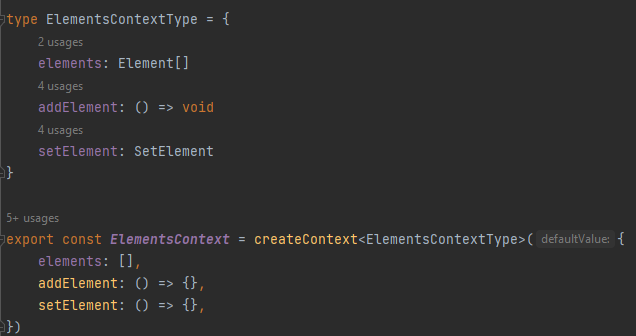
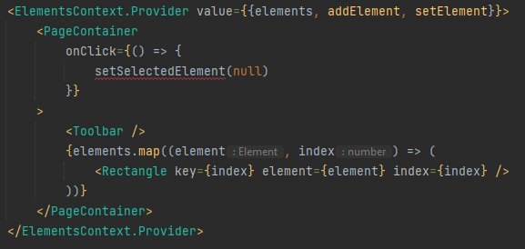

# Atom Families 

## Mise en place

Vous avez vu un certain nombre de notions de base de Recoil précédemment.  
Voyons désormais comment résoudre certaines problématiques que pourrait rencontrer React Context.  
Pour cela, retournons auprès de corps de notre application de canvas.  
En premier lieu, remplacez le contenu de votre fichier Canvas.tsx par le code suivant :  

````typescript jsx
import {createContext, useState} from 'react'
import {Element, Rectangle} from './components/Rectangle/Rectangle'
import {PageContainer} from './PageContainer'
import {Toolbar} from './Toolbar'

type ElementsContextType = {
    elements: Element[]
    addElement: () => void
    setElement: SetElement
}

export const ElementsContext = createContext<ElementsContextType>({
    elements: [],
    addElement: () => {},
    setElement: () => {},
})

type SelectedElementContextType = {
    selectedElement: number | null
    setSelectedElement: (index: number) => void
}

export const SelectedElementContext = createContext<SelectedElementContextType>({
    selectedElement: null,
    setSelectedElement: () => {},
})

export type SetElement = (indexToSet: number, newElement: Element) => void

function Canvas() {
    const [elements, setElements] = useState<Element[]>([])
    const [selectedElement, setSelectedElement] = useState<number | null>(null)

    const setElement: SetElement = (indexToSet, newElement) => {
        setElements(
            elements.map((element, index) => {
                if (indexToSet === index) return newElement
                return element
            }),
        )
    }

    const addElement = () => {
        setElements((elements) => {
            return [
                ...elements,
                {
                    style: {
                        position: {top: 100 + elements.length * 30, left: 100 + elements.length * 30},
                        size: {width: 200, height: 150},
                    },
                },
            ]
        })
    }

    return (
        <SelectedElementContext.Provider value={{selectedElement, setSelectedElement}}>
            <ElementsContext.Provider value={{elements, addElement, setElement}}>
                <PageContainer
                    onClick={() => {
                        setSelectedElement(null)
                    }}
                >
                    <Toolbar />
                    {elements.map((element, index) => (
                        <Rectangle key={index} element={element} index={index} />
                    ))}
                </PageContainer>
            </ElementsContext.Provider>
        </SelectedElementContext.Provider>
    )
}

export default Canvas
````

Ensuite, faites de même avec le fichier src/components/Rectangle/Rectangle.tsx, dont vous remplacerez le code 
par celui-ci : 

````typescript jsx
import {useContext} from 'react'
import {ElementsContext, SelectedElementContext} from '../../Canvas'
import {Drag} from '../Drag'
import {RectangleContainer} from './RectangleContainer'
import {RectangleInner} from './RectangleInner'

export type ElementStyle = {
    position: {top: number; left: number}
    size: {width: number; height: number}
}

export type Element = {style: ElementStyle}

export function Rectangle({element, index}: {element: Element; index: number}) {
    const {selectedElement, setSelectedElement} = useContext(SelectedElementContext)
    const {setElement} = useContext(ElementsContext)

    return (
        <Drag
            position={element.style.position}
            onDrag={(position) => {
                setElement(index, {
                    style: {
                        ...element.style,
                        position,
                    },
                })
            }}
        >
            <div>
                <RectangleContainer
                    position={element.style.position}
                    size={element.style.size}
                    onSelect={() => {
                        setSelectedElement(index)
                    }}
                >
                    <RectangleInner selected={index === selectedElement} />
                </RectangleContainer>
            </div>
        </Drag>
    )
}
````

Enfin, remplacez le code du fichier Toolbar.tsx par le code suivant : 

````typescript jsx
import {Icon, IconButton, VStack} from '@chakra-ui/react'
import {useContext} from 'react'
import {Square} from 'react-feather'
import {ElementsContext} from './Canvas'

export function Toolbar() {
    const {addElement} = useContext(ElementsContext)

    return (
        <VStack
            position="absolute"
            top="20px"
            left="20px"
            backgroundColor="white"
            padding={2}
            boxShadow="md"
            borderRadius="md"
            spacing={2}
        >
            <IconButton
                onClick={addElement}
                aria-label="Add rectangle"
                icon={<Icon style={{width: 24, height: 24}} as={Square} />}
            />
        </VStack>
    )
}
````

Très bien, désormais en vous rendant sur [http://localhost:3000/](http://localhost:3000/), vous pouvez constater que 
votre canvas est hooked up. Vous pouvez créer des éléments à la volée, en sélectionner (auquel cas, l'élément 
sélectionné aura une légère bordure grise le rendant reconnaissable), et enfin les déplacer.  
Comme vous pouvez le voir dans les fichiers modifiés (Canvas.tsx par exemple), le tout a été mis en place via 
React Context : 



Pour rappel, votre bootstrap dans l'application fait appel à votre Canvas component pour définir la route principale : 

````typescript jsx
ReactDOM.render(
    <React.StrictMode>
        <RecoilRoot>
            <ChakraProvider>
                <Router>
                    <Switch>
                        <Route path="/tutorials/atoms">
                            <AtomsExample />
                        </Route>
                        <Route path="/tutorials/selectors">
                            <SelectorsExample />
                        </Route>
                        <Route>
                            <Canvas />
                        </Route>
                    </Switch>
                </Router>
            </ChakraProvider>
        </RecoilRoot>
    </React.StrictMode>,
    document.getElementById('root'),
)
````

Et si vous allez dans votre fichier Canvas.tsx, vous constaterez que tous vos rectangles proviennent du mapping du 
tableau **element** : 

````typescript jsx
<SelectedElementContext.Provider value={{selectedElement, setSelectedElement}}>
    <ElementsContext.Provider value={{elements, addElement, setElement}}>
        <PageContainer
            onClick={() => {
                setSelectedElement(null)
            }}
        >
            <Toolbar />
            {elements.map((element, index) => (
                <Rectangle key={index} element={element} index={index} />
            ))}
        </PageContainer>
    </ElementsContext.Provider>
</SelectedElementContext.Provider>
````

C'est au même endroit que vous trouverez la logique permettant de garder en mémoire l'élément sélectionné.  
Pour ce faire, nous utilisons un Context Provider appelé SelectedElementContext : 

````typescript jsx
<SelectedElementContext.Provider value={{selectedElement, setSelectedElement}}>
````

Celui-ci nous procure **selectedElement** et **setSelectedElement**, le tout provenant du **useState** au début de la 
fonction *Canvas()* : 

````typescript jsx
const [selectedElement, setSelectedElement] = useState<number | null>(null)
````

C'est ce **useState** qui est en charge du storing de l'élément sélectionné. Le fait que celui-ci soit utilisé par le 
Provider permet à n'importe quel enfant de ce dernier d'y avoir accès.  
Si vous vous rendez votre fichier Rectangle.tsx, vous constatez que l'on fait appelle à ce state :  

````typescript jsx
const {selectedElement, setSelectedElement} = useContext(SelectedElementContext)
const {setElement} = useContext(ElementsContext)
````

Enfin, on vérifie que si le *selectedElement* correspond à l'index de notre élément courant, alors on a bien sélectionné 
ce rectangle : 

````typescript jsx
<RectangleInner selected={index === selectedElement} />
````

Le tout est set au moment du click sur l'élément que l'on veut sélectionner : 

````typescript jsx
<RectangleContainer
    position={element.style.position}
    size={element.style.size}
    onSelect={() => {
        setSelectedElement(index)
    }}
>
````

Comme vous pouvez vous en rendre compte, tout cela est plutôt lourd, bien que ce soit une manière assez courante de 
faire les choses avec React Context ... 😞
Mais heureusement pour nous, le code peut-être amélioré et simplifié grâce à **Recoil** !

## Upgrade via Recoil

Commençons donc par éditer notre Canvas.  
Nous remplacer le useState ainsi que le Context par un Recoil Atom.  
Tout d'abord, supprimez la ligne suivante de votre fonction Canvas() : 

````typescript jsx
const [selectedElement, setSelectedElement] = useState<number | null>(null)
````

Supprimez également le Contexte et le Type :

````typescript jsx
type SelectedElementContextType = {
    selectedElement: number | null
    setSelectedElement: (index: number) => void
}

export const SelectedElementContext = createContext<SelectedElementContextType>({
    selectedElement: null,
    setSelectedElement: () => {},
})
````

Et à la place, créons l'Atom suivant, que nous allons exporter afin de pouvoir l'utiliser au sein de notre application : 

````typescript jsx
export const selectedElementAtom = atom<number | null>({
    key: 'selectedElement',
    default: null
})
````

Vous pouvez désormais supprimer le Context Provider qui englobe le reste des éléments de votre retour.  
Vous devriez à présent voir une erreur au niveau du *setSelectedElement* contenu dans votre retour : 



Cette erreur est dûe au fait que *setSelectedElement* n'est pas initialisé. Hors, nous en avons besoin pour 
désélectionner les éléments lorsque nous cliquons sur la page.  
Déclarons donc la constante dont nous avons besoin avant notre retour :

````typescript jsx
const setSelectedElement = useSetRecoilState(selectedElementAtom)
````

Nous allons maintenant modifier notre fichier Rectangle.tsx. Vous pouvez constater que nous tentons toujours d'y 
importer le Context et de l'y utiliser. Supprimez l'import du Context ainsi que la ligne suivante : 

````typescript jsx
const {selectedElement, setSelectedElement} = useContext(SelectedElementContext)
````

À la place, nous allons importer **useRecoilState** ainsi que notre *selectedElementAtom* afin de pouvoir redéclarer nos 
*selectedElement* et *setSelectedElement*:

````typescript jsx
const [selectedElement, setSelectedElement] = useRecoilState(selectedElementAtom)
````

Si vous essayez de sélectionner un des rectangles que vous générez, cela devrait toujours fonctionner.  
Cependant, un problème persiste. Ce qu'il se passe en fond, c'est que lorsqu'un élément est sélectionné et/ou déplacé, 
alors le Context fait que le rendering se fait sur l'application au complet, et non pas juste sur l'élément sélectionné.  
Pour cette raison, nous allons nous débarrasser du Context. Toutefois, le problème persistera dans un premier temps 
malgré l'utilisation de Recoil, mais nous pourrons le régler plus tard.
Rendez-vous donc dans votre fichier Canvas.tsx et supprimez le Context : 

````typescript jsx

type ElementsContextType = {
    elements: Element[]
    addElement: () => void
    setElement: SetElement
}

export const ElementsContext = createContext<ElementsContextType>({
    elements: [],
    addElement: () => {},
    setElement: () => {},
})

export type SetElement = (indexToSet: number, newElement: Element) => void
````

Vous allez ensuite supprimer les constantes *setElement* et *addElement* contenues dans votre fonction Canvas() :

````typescript jsx
const setElement: SetElement = (indexToSet, newElement) => {
        setElements(
            elements.map((element, index) => {
                if (indexToSet === index) return newElement
                return element
            }),
        )
    }

    const addElement = () => {
        setElements((elements) => {
            return [
                ...elements,
                {
                    style: {
                        position: {top: 100 + elements.length * 30, left: 100 + elements.length * 30},
                        size: {width: 100, height: 100},
                    },
                },
            ]
        })
    }
````

Enfin, débarrassez-vous de votre *Context Provider* ainsi que de votre *useState*.  
À présent, au lieu de stocker nos éléments dans un *useState*, nous allons les stocker dans **Recoil**.  
La différence majeure va résider dans le fait qu'au lieu de tous les stocker dans un seul et unique *array*, chaque 
élément va être stocké **dans son propre atom**.  
Créons donc un nouvel atom, qui sera un tableau de nombres, que nous appellerons *elementsAtom* : 

````typescript jsx
export const elementsAtom = atom<number[]>({
    key: 'elements',
    default: []
})
````

Vous verrez pourquoi nous l'exportons lorsque nous nous attaquerons au fichier *Toolbar.tsx*.  
Ensuite, nous allons l'initialiser dans notre fonction Canvas() : 

````typescript jsx
function Canvas() {
    const setSelectedElement = useSetRecoilState(selectedElementAtom)
    const elements = useRecoilValue(elementsAtom)

    return (
        <PageContainer
            onClick={() => {
                setSelectedElement(null)
            }}
        >
            <Toolbar />
            {elements.map((element, index) => (
                <Rectangle key={index} element={element} index={index} />
            ))}
        </PageContainer>
    )
}
````

À présent, nous faisons notre mapping sur *elements* qui est un tableau de nombres faisant appel à notre *elementsAtom* 
où nous stockons les ids de nos éléments.  
Par conséquent, nous pouvons simplifier notre mapping de la façon suivante : 

````typescript jsx
return (
        <PageContainer
            onClick={() => {
                setSelectedElement(null)
            }}
        >
            <Toolbar />
            {elements.map((id) => (
                <Rectangle key={id} id={id} />
            ))}
        </PageContainer>
    )
````

Nous pouvons maintenant retourner dans notre fichier Rectangle.tsx où nous allons supprimer le *setElement* qui fait 
appel au *useContext*. Nous allons également modifier les propriétés de notre rectangle, car désormais nous voulons que 
sa seule et unique **prop** soit **id**, et que cet id soit défini comme un nombre :

````typescript jsx
export function Rectangle({id}: {id: number}) {
    const [selectedElement, setSelectedElement] = useRecoilState(selectedElementAtom)
````

## Utilisation de l'Atom Family

**ENFIN** !!! Nous arrivons au moment où nous allons voir quelque chose que nous n'avions pas vu précédemment : les 
**Atom Families**.


Toujours dans le même fichier Rectangle.tsx, importez votre **atomFamily** :

````typescript jsx
import {useRecoilState, atomFamily} from 'recoil'
````

Ensuite, nous allons définir en-dehors de notre constante Rectangle notre *atomFamily*, à qui on va set les types 
*Element* et *number* : 

````typescript jsx
// Le type «number» ici fait référence au type désiré pour id, qui se doit d'être serializable.
// Donc un number ou une string.
// Par ailleurs, nous allons exporter notre atomFamily car nous l'appellerons dans le cours suivant.
export const elementState = atomFamily<Element, number>({
    key: 'element',
    default: {
        style: {
            position: {top: 25, left: 100},
            size: {width: 100, height: 100}
        }
    },
})
````

Le type **number** correspond au type de notre **id**.
Comme vous pouvez le constater, une atomFamily est composée d'une **key*** et d'une **default value**, tout comme un 
atom. Ici, notre *default value* est un objet représentant notre rectangle.  
Nous pouvons à présent utiliser notre atomFamily dans notre Rectangle. Instancions cette dernière : 

````typescript jsx
const [selectedElement, setSelectedElement] = useRecoilState(selectedElementAtom)
const [] = useRecoilState(elementState)
````

Vous devriez avoir une erreur qui s'affiche sur votre IDE. Et cela est tout à fait normal, car vous ne pouvez pas 
simplement passer votre *atomFamily* à votre **useRecoilState**. Ce que vous devez faire en réalité, c'est appeler 
**elementState en tant que fonction**, et lui passer l'id du Rectangle : 

````typescript jsx
const [] = useRecoilState(elementState(id))
````

Grâce à cette mise en place, il va se passer la chose suivante : pour chaque rectangle, lorsque l'on fait appel à notre 
atomFamily avec un nouvel id, un nouvel atom est dès lors créé pour ce rectangle :  

````txt
            Atom Family

elementState(1) -> atom for element 1
elementState(2) -> atom for element 2
elementState(3) -> atom for element 3
elementState(n) -> atom for element n
````

Cela signifie entre autre, que peu importe le nombre de rectangles sur notre page, chacun d'entre eux aura son propre 
atom, dont le state sera isolé par cet atom.  
Désormais, nous pouvons implémenter *element* et *setElement* : 

````typescript jsx
const [element, setElement] = useRecoilState(elementState(id))
````

Maintenant, nous n'avons plus besoin de passer l'index lorsque nous faisons appel à **setElement**, puisque nous 
travaillons sur un atom spécifique, doté de son propre **id** :

````typescript jsx
<Drag
    position={element.style.position}
    onDrag={(position) => {
        setElement({
            style: {
                ...element.style,
                position,
            },
        })
    }}
>
````

De même, le stockage de nos éléments ne se faisant plus par *index*, mais par **id** désormais, nous pouvons modifier 
notre RectangleContainer : 

````typescript jsx
<RectangleContainer
    position={element.style.position}
    size={element.style.size}
    onSelect={() => {
        setSelectedElement(id)
    }}
>
    <RectangleInner selected={id === selectedElement} />
</RectangleContainer>
````

Il ne vous reste plus qu'à nettoyer les imports de vos fichiers Canvas.tsx et Rectangle.tsx.  
En dernier, mais pas des moindres, nous allons apporter les changements nécessaires à notre fichier **Toolbar.tsx**.  
Supprimez les imports suivants :

````typescript jsx
import {useContext} from 'react'
import {ElementsContext} from './Canvas'
````

Supprimez également le *useContext* :

````typescript jsx
const {addElement} = useContext(ElementsContext)
````

Nous allons désormais instancier au sein de la Toolbar notre **setElements** via un **useSetRecoilState** auquel nous 
passerons notre **elementsAtom** en paramètre : 

````typescript jsx
const setElements = useSetRecoilState(elementsAtom)
````

Puis, nous allons modifier l'événement **onClick** de notre bouton, en lui passant une fonction qui nous 
retournera un tableau. Cette fonction nous donnera la valeur courante de notre tableau *elements*, et elle retournera 
donc la nouvelle valeur du tableau, à savoir *elements* auquel aura été ajouté un nouvel index : 

````typescript jsx
 <IconButton
    onClick={() => {
        // Le paramètre elements de SetElements() correspond à la valeur courante du tableau.
        // [...elements, elements.length]) correspond à la nouvelle valeur de elements, à savoir
        // l'auto-incrémentation d'un nouvel id
            setElements((elements) => [...elements, elements.length])
        }
    }
    aria-label="Add rectangle"
    icon={<Icon style={{width: 24, height: 24}} as={Square} />}
/>
````

À noter que nous pourrions également gérer l'ensemble de la façon suivante : 

````typescript jsx
export function Toolbar() {
    const [elements, setElements] = useRecoilState(elementsAtom)

    return (
        <VStack
            position="absolute"
            top="20px"
            left="20px"
            backgroundColor="white"
            padding={2}
            boxShadow="md"
            borderRadius="md"
            spacing={2}
        >
            <IconButton
                onClick={() => {
                        setElements([...elements, elements.length])
                    }
                }
                aria-label="Add rectangle"
                icon={<Icon style={{width: 24, height: 24}} as={Square} />}
            />
        </VStack>
    )
}
````

Cependant, cette méthode est moins élégante. Mais pour votre culture personnelle, je vous la mets en exemple.  

## Synthèse

Il reste quelques optimisations de performances à apporter, mais résumons quand même ce que nous venons de voir :

- Si vous stockez le state de plusieurs éléments au sein d'un seul Context, alors, *vous ne pourrez pas faire en sorte 
de modifier un élément de sorte qu'une seule partie de ce state rerender*.
- Nous avons vu comment palier à ce problème via Recoil en utilisant un nouvel objet nommé **atomFamily**, permettant 
de stocker le state de chaque élément au dans son propre atom.

Vous constaterez le gain en performances qu'offre cette méthodologie sitôt que vous aurez un nombre conséquent 
d'éléments sur une page de votre application.😉