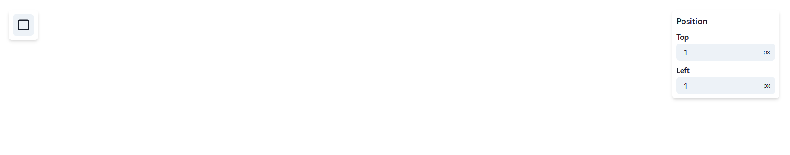
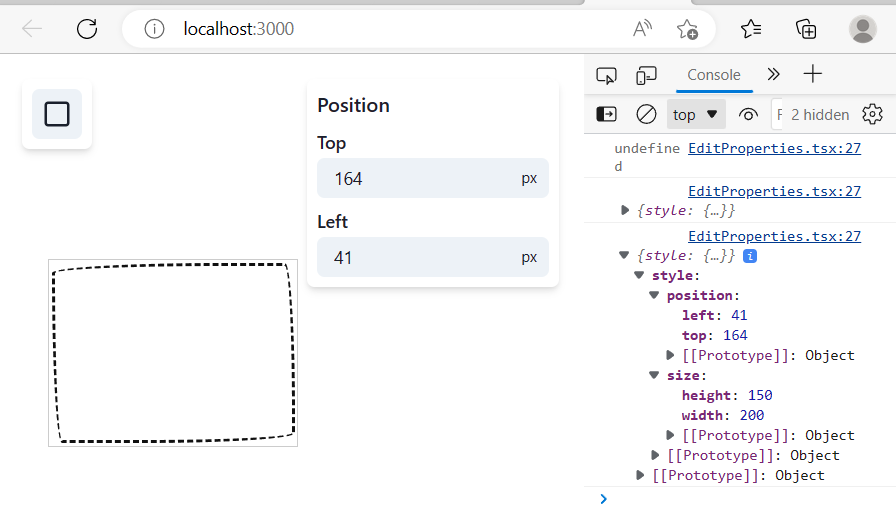
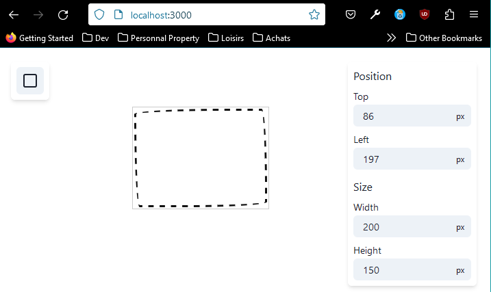

# Atom Families - Suite

Dans ce cours, nous allons continuer à voir les Atom Families en ajoutant de nouvelles fonctionnalités à notre 
application.  
Tout d'abord, remplacez le code de votre fichier src/components/Resize.tsx par le code suivant :

````typescript jsx
import {Resizable, ResizeHandle} from 'react-resizable'
import {Handle} from './Handle'
import {ElementStyle} from './Rectangle/Rectangle'

const handlePlacements: ResizeHandle[] = ['n', 's', 'e', 'w', 'ne', 'nw', 'se', 'sw']

type ResizeProps = {
    selected: boolean
    onResize: (style: ElementStyle) => void
} & ElementStyle

export const Resize: React.FC<ResizeProps> = ({selected, children, position, size, onResize}) => {
    return (
        <Resizable
            width={size.width}
            height={size.height}
            onResize={(_, {size: newSize, handle}) => {
                let topDiff = 0
                if (handle.includes('n')) {
                    topDiff = size.height - newSize.height
                }

                let leftDiff = 0
                if (handle.includes('w')) {
                    leftDiff = size.width - newSize.width
                }

                onResize({
                    size: {
                        width: Math.round(newSize.width),
                        height: Math.round(newSize.height),
                    },
                    position: {
                        top: position.top + topDiff,
                        left: position.left + leftDiff,
                    },
                })
            }}
            resizeHandles={handlePlacements}
            handle={(placement) => (
                <div>
                    <Handle placement={placement} visible={selected} />
                </div>
            )}
        >
            <div>{children}</div>
        </Resizable>
    )
}
````

Ensuite, dans votre dossier src/ créez un fichier EditProperties.tsx dans lequel vous copierez le code suivant : 

````typescript jsx
import {InputGroup, InputRightElement, NumberInput, NumberInputField, Text, VStack} from '@chakra-ui/react'

export function EditProperties() {
    return (
        <Card>
            <Section heading="Position">
                <Property label="Top" value={1} onChange={(top) => {}} />
                <Property label="Left" value={1} onChange={(left) => {}} />
            </Section>
        </Card>
    )
}

const Section: React.FC<{heading: string}> = ({heading, children}) => {
    return (
        <VStack spacing={2} align="flex-start">
            <Text fontWeight="500">{heading}</Text>
            {children}
        </VStack>
    )
}

function Property({label, value, onChange}: {label: string; value: number; onChange: (value: number) => void}) {
    return (
        <div>
            <Text fontSize="14px" fontWeight="500" mb="2px">
                {label}
            </Text>
            <InputGroup size="sm" variant="filled">
                <NumberInput value={value} onChange={(_, value) => onChange(value)}>
                    <NumberInputField borderRadius="md" />
                    <InputRightElement pointerEvents="none" children="px" lineHeight="1" fontSize="12px" />
                </NumberInput>
            </InputGroup>
        </div>
    )
}

const Card: React.FC = ({children}) => (
    <VStack
        position="absolute"
        top="20px"
        right="20px"
        backgroundColor="white"
        padding={2}
        boxShadow="md"
        borderRadius="md"
        spacing={3}
        align="flex-start"
        onClick={(e) => e.stopPropagation()}
    >
        {children}
    </VStack>
)
````

Maintenant, importez votre component EditProperties dans votre fichier Canvas.tsx de la manière suivante : 

````typescript jsx
import {EditProperties} from './EditProperties'
````

````typescript jsx
function Canvas() {
    const setSelectedElement = useSetRecoilState(selectedElementAtom)
    const elements = useRecoilValue(elementsAtom)

    return (
        <PageContainer
            onClick={() => {
                setSelectedElement(null)
            }}
        >
            <Toolbar />
            <EditProperties />
            {elements.map((id) => (
                <Rectangle key={id} id={id} />
            ))}
        </PageContainer>
    )
}
````

À présent, si vous vous rendez sur votre [http://localhost:3000/](http://localhost:3000/), vous devriez avoir le rendu 
suivant : 



Vous voyez désormais une nouvelle sidebar qui va nous permettre d'ajuster la position de nos rectangles.  
Allons à présent dans nore fichier EditProperties.tsx afin de nous lancer dans le développement de nos nouvelles 
fonctionnalités.  

````typescript jsx
<Section heading="Position">
    <Property label="Top" value={1} onChange={(top) => {}} />
    <Property label="Left" value={1} onChange={(left) => {}} />
</Section>
````

La section ci-dessus correspond au display de la sidebar de votre localhost.  
Ce que nous voulons désormais, c'est faire en sorte que les valeurs *Top* et *Left* affichées correspondent à celles de 
l'élément courant sélectionné, mais également que lorsque l'on déplace l'élément, que ces valeurs soient modifiées dans 
le state, ou encore qu'en modifiant ces valeurs à la volée, alors l'élément se déplace de la manière souhaitée.  
Nous voulons par conséquent pouvoir déterminer quel élément est sélectionné, et à quelle instance d'atom celui-ci 
correspond, via notre **atomFamily**, et donc récupérer le state depuis cet endroit.  
Pour arriver à nos fins, nous allons mettre en place un **Selector** (souvenez-vous, vous avez vu cet élément 
précédemment dans le cours) : 

````typescript jsx
import {selectedElementAtom} from './Canvas'
import {elementState} from './components/Rectangle/Rectangle'

const selectedElementProperties = selector({
    key: 'selectedElementProperties',
    // Fetching de la value de l'atom
    get: ({get}) => {
        const selectedElementId = get(selectedElementAtom)
        
        // Puisque selectedElementAtom peut être de type «number» ou «null», nous devons mettre en place une condition 
        // au cas où celui-ci serait null, pour la simple et bonne raison que si nous n'avons pas d'élément sélectionné, 
        // alors il n'y a aucune valeur à retourner. Nous mettons donc en place un retour qui sera «undefined».
        if (selectedElementId == null) return
        
        // Récupération de l'Atom Family à qui on passe l'id de l'atom désiré en paramètre
        return get(elementState(selectedElementId))
    }
})
````

Comme vous pouvez le voir ci-dessus, une **Atom Family** est une fonction que vous appelez *en lui passant un paramètre 
spécifique*, et *qui retournera un Atom de Recoil* : 


Et puisque notre méthode **get** nous permet de récupérer un **atom**, peu importe que celui-ci soit un simple atom, ou 
un atom qui aura été récupéré via une atom family.

Enfin, au sein de votre constante EditProperties, récupérez votre *selector* grâce à **useRecoilValue** (puisque nous ne 
voulons que la valeur) :

````typescript jsx
const element = useRecoilValue(selectedElementProperties)

console.log(element)
````

À présent, vous pouvez constater en console que votre element est undefined :


Mais sitôt que vous le sélectionnez, vous obtenez en console un objet qui correspond à votre element : 



Maintenant, nous voulons que les valeurs en console soient en adéquation avec celles de notre sidebar.  
Comme dans la capture d'écran ci-dessus.  
Tout d'abord, à la place de votre console.log() ajoutez la ligne suivante :

````typescript jsx
if (!element) return null
````

Ainsi, lorsque aucun élément ne sera sélectionné, la sidebar ne s'affichera pas inutilement.

Ensuite, vous n'avez plus qu'à changer les values de vos Property de la manière suivante :

````typescript jsx
<Card>
    <Section heading="Position">
        <Property label="Top" value={element.style.position.top} onChange={(top) => {}} />
        <Property label="Left" value={element.style.position.left} onChange={(left) => {}} />
    </Section>
</Card>
````

Parfait ! Désormais, lorsque vous déplacez votre rectangle, ses valeurs *top* et *left* changent dans votre sidebar.  
Cet exemple illustre parfaitement la raison pour laquelle les **Atom Families** existent.  
Si vous vouliez isoler les rendus de différents éléments, par exemple une vingtaine de rectangles, alors vous pourriez 
parfaitement le faire en stockant le state dans un useState dans le composant lui-même.  
Le point positif est que seul le composant serait affecté par les changements de son state.  
Le point négatif, et même très négatif, est qu'il est impossible de partager son state avec un autre composant, comme 
par la sidebar par exemple.  

C'est là qu'est la force de Recoil. Il permet l'isolation du state, tout en le rendant partageable avec d'autres 
composants.

À présent, nous voudrions pouvoir changer les valeurs de la sidebar à la volée, afin d'affecter le composant 
sélectionné.  
Pour cela, nous allons mettre en place un **set**, comme lors de notre précédente utilisation d'un **selector** :

````typescript jsx
import {Element, elementState} from './components/Rectangle/Rectangle'

// <Element | undefined> est un typage nécessaire pour le setter, 
// afin que TypeScript sache ce que nous voulons retourner
const selectedElementProperties = selector<Element | undefined>({
    key: 'selectedElementProperties',
    get: ({get}) => {
        const selectedElementId = get(selectedElementAtom)

        if (selectedElementId == null) return

        return get(elementState(selectedElementId))
    },
    set: ({get, set}, newElement) => {
        // Récupération de l'élément auquel on veut attribuer une nouvelle valeur
        const selectedElementId = get(selectedElementAtom)
        
        // Condition nécessaire au cas où aucun élément ne serait sélectionné
        if (selectedElementId == null) return
        // Condition nécessaire car newElement n'est typé ni comme Element, ni comme undefined
        if (!newElement) return

        return set(elementState(selectedElementId), newElement)
    }
})
````

Maintenant que notre **selector** est settable, nous pouvons utiliser **useRecoilState** 
à la place de *useRecoilValue* : 

````typescript jsx
export function EditProperties() {
    // déstructuration de notre constante
    const [element, setElement] = useRecoilState(selectedElementProperties)

    if (!element) return null

    return (
        <Card>
            <Section heading="Position">
                <Property label="Top" value={element.style.position.top} onChange={(top) => {
                    setElement({
                        // spreading de la valeur actuelle de element   
                        ...element,
                        style: {
                            // surcharge du style via le spreading de la valeur actuelle de style
                            ...element.style,
                            position: {
                                // surcharge de la position via le spreading de la valeur actuelle de position
                                ...element.style.position,
                                // setting de la nouvelle valeur de top
                                top,
                            }
                        }
                    })
                }} />
                <Property label="Left" value={element.style.position.left} onChange={(left) => {}} />
            </Section>
        </Card>
    )
}
````

Vous pouvez ici constater à quel point le **selector** de Recoil va vous simplifier la vie. Toute la logique complexe de 
gestion du state est contenue dans le *selector*, alors que lorsque vous faites appel à ce dernier, c'est aussi simple 
que lorsque vous utilisez un *atom*. À côté de ça, le *selector* gère en tâche de fond toute la logique de quel élément 
est sélectionné, etc.

Voilà, mission accomplie, dorénavant vous pourrez changer les valeurs de votre élément sélectionné directement dans 
votre sidebar afin de le déplacer depuis cette dernière. 😌

## Refacto

Désormais, il faudrait faire la même chose avec la Property left, mais si nous nous contentions de juste copier le code 
en remplaçant les valeurs top par left, cela donnerait quelque chose de lourd ...  
À vous maintenant de trouver une solution pour que cette fonctionnalité marche aussi bien pour la partie top que la 
partie left, mais sans avoir de duplication de code.  
Bonne refacto ! 😁

## Update de la size de l'élément sélectionné

Maintenant que tout est fonctionnel en ce qui concerne la position de notre élément, nous allons vouloir changer sa 
**size** (et oui, pour rappel, le *style* de nos éléments est composé d'une position et d'une size).  
Pour ce faire, nous allons créer une autre **Section** : 

````typescript jsx
<Section heading="Size">
    <Property label="Width" value={element.style.size.width} onChange={(top) => {
        setPosition('top', top)}
    } />
    <Property label="Height" value={element.style.size.height} onChange={(left) => {
        setPosition('left', left)
    }} />
</Section>
````

Maintenant, il ne vous reste plus qu'à changer l'événement **onChange** comme vous l'avez fait précédemment pour la 
position (et oui, je n'allais pas vous donner la solution à l'exercice précédent dans la section qui suit ! Bande de 
coquinoux).  

Vous devriez obtenir un display comme ci-dessous (à cela prêt que vous n'aurez pas mes folders, of course) :



Si vous essayez de changer la taille de votre rectange dans la section, vous verrez que cela fonctionne parfaitement.  
Le seul vrai problème, c'est que le code est assez dense, et franchement la duplication ... merci bien ...  
Mais ne vous inquiétez pas, nous améliorerons cela dans le prochain chapitre, lorsque nous aborderons les **Selector 
Families**, afin de gagner en propreté et en performances.  

En attendant, nous allons chercher à faire une dernière amélioration, qui sera de gérer le resizing de notre rectangle 
via du dragging (ce qui sera nettement plus agréable que de gérer cela via un input).  

Dans votre fichier Rectangle.tsx, vous vouloir wrap votre *Drag* component dans le *Resize* component que nous avons 
modifié plus tôt, et wrap ce *Resize* component lui-même dans votre *RectangleContainer* de la manière qui suit : 

````typescript jsx
// Extériorisation de notre valeur id === selectedElement qui se trouvait dans <RectangleInner selected={} />
const selected = id === selectedElement // valeur booléenne

return (
        <RectangleContainer
            position={element.style.position}
            size={element.style.size}
            onSelect={() => {
                setSelectedElement(id)
            }}
        >
            <Resize
                // Récupération de notre valeur booléenne selected, permettant ainsi de cacher le resize handler en 
                // fonction de si l'élément est sélectionné ou non
                selected={selected}
                // On dérive le style de notre élément, c'est pour cela que l'on récupère position & size. Par ailleurs, 
                // la position étant également impactée par le dragging, cela explique que l'on ne se contente pas de 
                // récupérer la size
                onResize={(style) => {
                    setElement({
                        ...element,
                        style,
                    })
                }}
                // Récupération des valeurs position & size de notre élément
                position={element.style.position}
                size={element.style.size}>
                <Drag
                    position={element.style.position}
                    onDrag={(position) => {
                        setElement({
                            style: {
                                ...element.style,
                                position,
                            },
                        })
                    }}
                >
                    <div>
                        {/* Récupération de notre valeur booléenne selected */}
                        <RectangleInner selected={selected} />
                    </div>
                </Drag>
            </Resize>
        </RectangleContainer>
    )
````

Vous pouvez enfin modifier la taille d'un élément sélectionné à la volée en faisant du dragging depuis un coin ou un 
côté.  

# Synthèse

En définitive, à travers ce chapitre, nous avons revu :

- Les différents avantages que peuvent apporter les Atom Families, c'est-à-dire les atouts en terme de performances que 
peuvent procurer des states lorsque ces derniers sont isolés, tout en permettant à ces states d'être partagés à travers 
d'autres components.
- Nous avons également vu que nous pouvions récupérer les valeurs d'une **Atom Family** via un **Selector**, car une 
Atom Family retourne un Atom lorsque celle-ci est appelée.
- Enfin, nous avons vu qu'un **Selector** contient toute la logique du state management, et vous fournit également 
une API très simple d'utilisation lorsque vous l'utilisez.

Tout ceci nous a permis d'obtenir l'application que nous avons en l'état.  
Le seul point noir est la duplication de notre code dans EditProperties.tsx, qui se veut un peu lourd et redondant par 
moment, mais tout de même moins qu'en utilisant React Context.  
La raison pour laquelle nous avons géré les choses de cette manière, est parce que la valeur retournée par le Selector 
est du même type que celle du **setElement** : 

````typescript jsx
const [element, setElement] = useRecoilState(selectedElementProperties)
````

Ceci est une limitation de l'API de Recoil, mais vous allez désormais voir comment contourner ce problème grâce aux 
**Selector Families**.