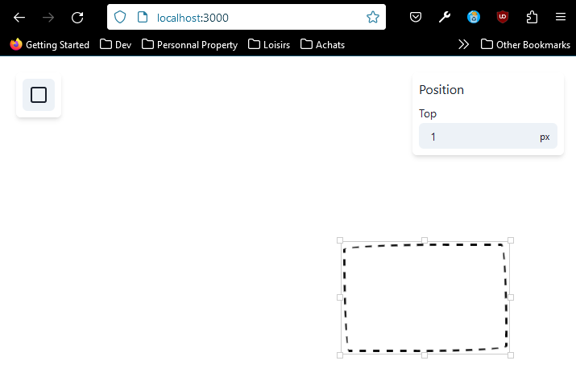
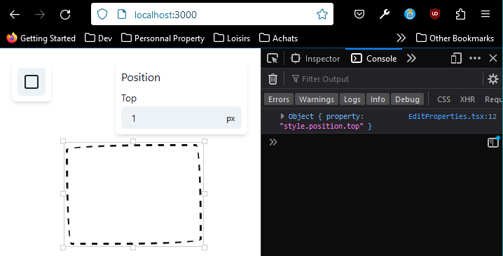
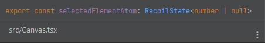
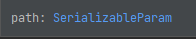

# Selector Families

## Mise en place

Tout d'abord, nous allons installer deux packages qui nous seront utiles dans l'amélioration de notre application : 
**immer** et **lodash**.  
Pour ce faire, tapez la commande suivante dans votre terminal : 

````bash
npm install immer lodash
````

Ou si vous utilisez yarn : 

````bash
yarn add immer lodash
````

Ensuite, vous allez faire un peu de ménage en remplaçant le code de votre fichier EditProperties.tsx par celui 
ci-dessous : 

````typescript jsx
import {InputGroup, InputRightElement, NumberInput, NumberInputField, Text, VStack} from '@chakra-ui/react'
import {selector, useRecoilState} from 'recoil'
import {selectedElementAtom} from './Canvas'
import {Element, elementState} from './components/Rectangle/Rectangle'

export function EditProperties() {

    return (
        <Card>
            <Section heading="Position">
                <Property 
                    label="Top"
                    value={1}
                    onChange={(top) => {}
                } />
                {/*<Property label="Left" value={element.style.position.left} onChange={(left) => {*/}
                {/*    setPosition('left', left)*/}
                {/*}} />*/}
            </Section>
            {/*<Section heading="Size">*/}
            {/*    <Property label="Width" value={element.style.size.width} onChange={(width) => {*/}
            {/*        setSize('width', width)}*/}
            {/*    } />*/}
            {/*    <Property label="Height" value={element.style.size.height} onChange={(height) => {*/}
            {/*        setSize('height', height)*/}
            {/*    }} />*/}
            {/*</Section>*/}
        </Card>
    )
}

const Section: React.FC<{heading: string}> = ({heading, children}) => {
    return (
        <VStack spacing={2} align="flex-start">
            <Text fontWeight="500">{heading}</Text>
            {children}
        </VStack>
    )
}

function Property({label, value, onChange}: {label: string; value: number; onChange: (value: number) => void}) {
    return (
        <div>
            <Text fontSize="14px" fontWeight="500" mb="2px">
                {label}
            </Text>
            <InputGroup size="sm" variant="filled">
                <NumberInput value={value} onChange={(_, value) => onChange(value)}>
                    <NumberInputField borderRadius="md" />
                    <InputRightElement pointerEvents="none" children="px" lineHeight="1" fontSize="12px" />
                </NumberInput>
            </InputGroup>
        </div>
    )
}

const Card: React.FC = ({children}) => (
    <VStack
        position="absolute"
        top="20px"
        right="20px"
        backgroundColor="white"
        padding={2}
        boxShadow="md"
        borderRadius="md"
        spacing={3}
        align="flex-start"
        onClick={(e) => e.stopPropagation()}
    >
        {children}
    </VStack>
)
````

Comme vous pouvez le voir, nous nous sommes débarrassés de notre **Selector**, notre **useRecoilState** ainsi que de 
toute la logique de notre sidebar, à cela prêt que nous conservons une section pour display une valeur fixe.  
Nous allons donc reprendre toute cette logique depuis le début, mais sous un nouvel angle.  

Vous devriez avoir un display ressemblant à celui-ci : 



Nous allons désormais hook up notre top value à une **Selector Family**.  
Supprimez au préalable les imports suivants, puisqu'ils ne nous servent plus désormais : 

````typescript jsx
import {selector, useRecoilState} from 'recoil'
import {selectedElementAtom} from './Canvas'
import {Element, elementState} from './components/Rectangle/Rectangle'
````

## Utilisation de la Selector Family

Créons à présent une constante *editPropertyState*, qui sera notre **Selector Family** :

````typescript jsx
const editPropertyState = selectorFamily({
    // Comme un Selector, une selectorFamily possède une key
    key: 'editProperty',
    // Cependant, son getter est composé d'une fonction (contenant un paramètre sérializable), qui retournera une autre 
    // fonction dont le paramètre sera get.
    get: (path) => ({get}) => {
        // Dans un premier temps, nous allons voir ce que nous retourne notre selector
        return path
    }
})
````

Ensuite, instancions notre *selectorFamily* au sein de notre constante **EditProperties** :

````typescript jsx
// Ici vous pouvez comprendre à quoi correspond notre paramètre «path».
// Toutes nos Property accèdent à une partie de notre element. Et c'est le chemin de vers cet accès que va représenter 
// notre paramètre «path». Ici 'style.position.top'
const property = useRecoilValue(editPropertyState('style.position.top'))
console.log({property})
````

Vous constaterez alors que nous récupérons bien le paramètre que nous avons passé, à savoir le path : 



Toutefois, ce que nous désirons est tout autre. Nous voulons pouvoir récupérer la valeur courante de ce path. Pour cela, 
nous allons procéder de manière assez similaire à ce que nous avons fait dans le chapitre précédent.  
Tout d'abord, récupérer l'élément sélectionné : 

````typescript jsx
const editPropertyState = selectorFamily({
    key: 'editProperty',
    get: (path) => ({get}) => {
        const selectedElement = get(selectedElementAtom)

        if (selectedElement == null) return null
        
        return path
    }
})
````

Ce qui nous donnera l'**id de l'élément sélectionné** ou **null**, comme avec un *Selector* classique, d'où notre 
condtion : 



Récupérons à présent notre élément et retournons le chemin de ce dernier : 

````typescript jsx
const editPropertyState = selectorFamily({
    key: 'editProperty',
    get: (path) => ({get}) => {
        const selectedElement = get(selectedElementAtom)
        
        if (selectedElement == null) return null

        const element = get(elementState(selectedElement))
        
        return element[path]
    }
})
````


Ici vous devriez avoir une erreur. Et la raison est assez simple :  
*'style.position.top'* est ce que l'on appelle un *nested path*, et à cause des points contenus dans le chemin, nous ne 
pouvons pas le récupérer en l'état.  
Nous pourrions parfaitement avoir un retour tel que celui qui suit : 

````typescript jsx
return element['style.position.top']
````

Et cette approche serait totalement valide, mais retirerait tout le dynamisme de notre **Selector Family**.  
C'est pour cette raison que nous avons installé certains packages au début de ce cours.  
En haut de votre fichier, vous allez donc importer une partie du package *lodash* de la manière suivante : 

````typescript jsx
import { get as lodashGet } from 'lodash'
````

Nous ne désirons que la fonction *get*, donc inutile d'importer le bundle complet. Par ailleurs, un alias est donné à 
l'import afin d'éviter qu'il y ait collusion entre le nom de la fonction de *lodash* et notre getter.  
Ensuite, vous allez remplacer le retour de votre **selectorFamily** par celui qui suit : 

````typescript jsx
return lodashGet(element, path)
````

Désormais, vous devriez avoir une erreur de typage sur votre paramètre *path*. Cela est dû au fait que c'est un 
SerializableParam, et votre fonction *get* de *lodash* attend une string.



Pour résoudre ce dernier problème, rien de plus simple, nous allons typer notre **selectorFamily** de la manière 
suivante :

````typescript jsx
// Le premier argument va être le type de la valeur retournée par le selector, donc un number.
// Le second argument va correspondre au type désiré pour notre path.
const editPropertyState = selectorFamily<number | null, string>({
    key: 'editProperty',
    get: (path) => ({get}) => {
        const selectedElement = get(selectedElementAtom)
        
        if (selectedElement == null) return null

        const element = get(elementState(selectedElement))

        return lodashGet(element, path)
    }
})
````

**NOTA BENE** :  

Si vous aviez voulu importer tout **lodash** car vous pourriez avoir besoin d'autres méthodes du bundle dans votre 
fichier, voici la manière dont vous auriez pu procéder : 

````typescript jsx
import _ from 'lodash'

const editPropertyState = selectorFamily<number | null, string>({
    key: 'editProperty',
    get: (path) => ({get}) => {
        const selectedElement = get(selectedElementAtom)

        if (selectedElement == null) return null

        const element = get(elementState(selectedElement))

        return _.get(element, path)
    }
})
````

Notez que cette méthode est bien plus lourde à cause du poids du bundle. Mais cela peut s'envisager pour un petit projet 
bien que ce soit sous-optimal.

Enfin, vous n'avez plus qu'à ajouter une condition dans votre constante *EditProperties* au cas où vous n'auriez pas 
sélectionné d'élément :

````typescript jsx
// La valeur a été renommée top pour le moment, puisque l'ont sélectionne le top.
const top = useRecoilValue(editPropertyState('style.position.top'))
if (top == null) return null
````

À présent, nous arrivons à récupérer la valeur de notre trop. Mais nous ne pouvons toujours pas la changer via l'input.  
Donc comme pour un *selector* classique, nous allons mettre en place un setter. La différence principale sera que, comme 
pour notre fonction get, ce sera une fonction qui retourne une fonction : 

````typescript jsx
import { get as lodashGet, set as lodashSet } from 'lodash'
import produce from 'immer'

const editPropertyState = selectorFamily<number | null, string>({
    key: 'editProperty',
    get: (path) => ({get}) => {
        const selectedElement = get(selectedElementAtom)

        if (selectedElement == null) return null

        const element = get(elementState(selectedElement))

        return lodashGet(element, path)
    },
    // Mise en place du setter à qui on passe également le path, le reste fonctionne comme pour le setter d'un selector 
    // classique
    set: (path) => ({get, set}, newValue) => {
        // On récupère notre élément comme pour le getter
        const selectedElement = get(selectedElementAtom)

        if (selectedElement == null) return null

        const element = get(elementState(selectedElement))
        // L'ajout principal va se faire ici :
        // Nous déclarons un nouvel élément qui fera appel à la fonction «produce» de «immer».
        // Le principe de la création de ce nouvel élément, fait à partir de notre objet «element», est qu'ainsi, nous 
        // évitons la mutation de notre premier objet. Car lodash fait muter notre objet, et puisque Recoil repose sur 
        // l'immutabilité, cela signifie que vous n'avez en aucun cas le droit le faire muter le state de Recoil. 
        // Donc lorsque vous faites le set d'un objet, cela doit être un nouvel objet, comme ce serait le cas pour les 
        // states de Redux ou React.
        // immer va donc se charger de nous créer un nouvel objet à partir de notre element et de son draft, et ce 
        // nouvel objet sera basé sur lodashSet(draft, path, newValue).
        const newElement = produce(element, (draft) => {
            // Appel de l'alias mis en place pour le setter de lodash, à qui on passe notre draft plutôt que notre 
            // element, ainsi que le path, et la nouvelle valeur newValue que l'on désire appliquer à notre élément.
            lodashSet(draft, path, newValue)
        })
        
        // Mise à jour de l'atom afin d'avoir un rendu de notre nouvel objet.
        set(elementState(selectedElement), newElement)
    }
})

export function EditProperties() {
    // Déstructuration de notre constante et appel à useRecoilState puisque désormais notre Selector Family possède à la 
    // fois un getter et un setter
    const [top, setTop] = useRecoilState(editPropertyState('style.position.top'))
    if (top == null) return null

    return (
        <Card>
            <Section heading="Position">
                <Property
                    label="Top"
                    value={top}
                    // On peut simplement passer notre setTop à l'élément onChange pour appliquer les changements.
                    onChange={setTop} />
                {/*<Property label="Left" value={element.style.position.left} onChange={(left) => {*/}
                {/*    setPosition('left', left)*/}
                {/*}} />*/}
            </Section>
            {/*<Section heading="Size">*/}
            {/*    <Property label="Width" value={element.style.size.width} onChange={(width) => {*/}
            {/*        setSize('width', width)}*/}
            {/*    } />*/}
            {/*    <Property label="Height" value={element.style.size.height} onChange={(height) => {*/}
            {/*        setSize('height', height)*/}
            {/*    }} />*/}
            {/*</Section>*/}
        </Card>
    )
}
````

Parfait ! Tout est fonctionnel ! 🙌  
Nous n'avons plus qu'à dupliquer notre *useRecoilState* et lui passer à chaque fois un chemin différent ... 💩  
Ou pas ! 😋  

Nous allons plutôt exporter ce *useRecoilState* et le rendre plus dynamique, passer un paramètre **path** à notre 
*Property* comme ci-dessous :

````typescript jsx
<Property label="Top" path="style.position.top" />
````

Vous allez donc supprimer les deux lignes ci-dessous de votre constante *EditProperties* :

````typescript jsx
const [top, setTop] = useRecoilState(editPropertyState('style.position.top'))
if (top == null) return null
````

Et maintenant, nous allons modifier notre composant **Property**. À la place de la *value* et du *onChange*, nous allons 
lui passer un **path** qui sera une string. Puis nous lui passerons notre **useRecoilState** :

````typescript jsx
// Remplacement de la value et du onChange par un path qui sera une string.
function Property({label, path}: {label: string; path: string}) {
    // La déstructuration prend désormais value et setValue en valeur, et on passe le path à notre useRecoilState de 
    // manière à être plus dynamique.
    const [value, setValue] = useRecoilState(editPropertyState(path))
    if (value == null) return null

    return (
        <div>
            <Text fontSize="14px" fontWeight="500" mb="2px">
                {label}
            </Text>
            <InputGroup size="sm" variant="filled">
                {/* Remplacement des valeurs précédentes par value et setValue */}
                <NumberInput value={value} onChange={(_, value) => setValue(value)}>
                    <NumberInputField borderRadius="md" />
                    <InputRightElement pointerEvents="none" children="px" lineHeight="1" fontSize="12px" />
                </NumberInput>
            </InputGroup>
        </div>
    )
}
````

Tout est fonctionnel ! ✌️  
Vous pouvez enfin décommenter toutes les *Property* et leur donner le path voulu comme ci-dessous :

````typescript jsx
export function EditProperties() {
    // Constante et condition nécessaires pour éviter d'afficher la sidebar lorsqu'aucun élément n'est sélectionné.
    const selectedElement = useRecoilValue(selectedElementAtom)
    if (selectedElement == null) return null

    return (
        <Card>
            <Section heading="Position">
                <Property label="Top" path="style.position.top" />
                <Property label="Left" path="style.position.left" />
            </Section>
            <Section heading="Size">
                <Property label="Width" path="style.size.width"/>
                <Property label="Height" path="style.size.height"/>
            </Section>
        </Card>
    )
}
````

Alors ?! Est-ce que le code que vous avez maintenant ne vous semble pas beaucoup plus propre que le code de départ ? 😇  

## Exercice de refacto

Afin de terminer ce chapitre, une dernière « amélioration » que nous pourrions apporter à l'application serait de nous 
passer de nos checks tels que : 

````typescript jsx
if (value == null) return null
````

Pour ce faire, nous pouvons passer à notre *editPropertyState* l'id de l'element en plus de son path.  
Et si vous essayiez de faire ça par vous-mêmes ? 🐸  
Attention, vous risquez d'avoir à réfléchir un petit peu (par exemple, ne serait-il pas intelligent de déstructurer le 
**path** de votre *editPropertyState* en un objet composé de deux paramètres ? 😏).  

*À noter* : *j'ai mis que c'était une amélioration entre guillemets, car les deux approches sont viables, et très 
honnêtement, il serait difficile de justifier l'une plutôt que l'autre, si ce n'est pour une question de préférences.*

## Synthèse 

Maintenant que nous avons vu les **Selector Families**, nous pouvons en conclure les avantages de ces dernières :

- Une **Selector Family** possède les avantages d'un **Selector** :
  - On utilise la **même API** que pour les *AtomsExample*.
  - Le state est non seulement contenu au sein d'un même composant, mais en plus, celui-ci est **facilement partageable**
    à travers d'autres composants n'importe où au sein de notre application.
  - La logique des getter et setter est *contenue en un seul et unique endroit*.
- Un autre avantage que nous n'avons pas vu, mais qu'il est important de connaître, est qu'un Selector ou une Selector 
  Family, sont très pratiques pour ce qui est du fetching de data de manière asynchrone.
- Mais l'avantage principal est qu'une Selector Family nous permet d'avoir des SelectorsExample qui se ressemblent énormément 
  les uns par rapport aux autres, tout en ayant un comportement qui sera très légèrement différent.
- Un dernier avantage dont vous ne pouviez pas forcément vous rendre compte, est que vous faites toujours appel au même 
  Selector, lorsque vous lui passez les mêmes paramètres. Cela signifie entre autre que votre Selector ne run qu'une 
  seule et unique fois. Donc peu importe le nombre de fois où vous ferez appel à votre Selector, ou le nombre d'endroits 
  où ce dernier est appelé, la computation ne se fera qu'une seule fois. Ce qui peut donner un avantage assez massif en 
  termes de performances.

*Side Note* : Retenez que votre **param doit toujours être une valeur serializable**. Ce qui signifie entre autre que 
              votre param doit pouvoir être passé à **json.stringify**. Il peut donc être de type *boolean*, *string*,
              *number*, ou alors être **un objet contenant ces types**.
              Cela signifie également que *vous ne pouvez pas utiliser* une **Promise**, car cette dernière n'est pas 
              serializable. Tout ceci est dû au fait que *Recoil* compare les objets par leurs valeurs, et non pas par 
              l'équivalence de leurs références.